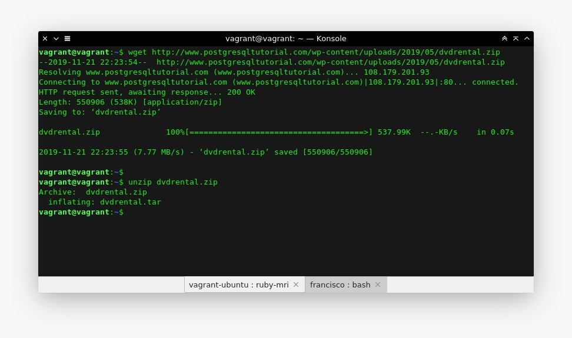
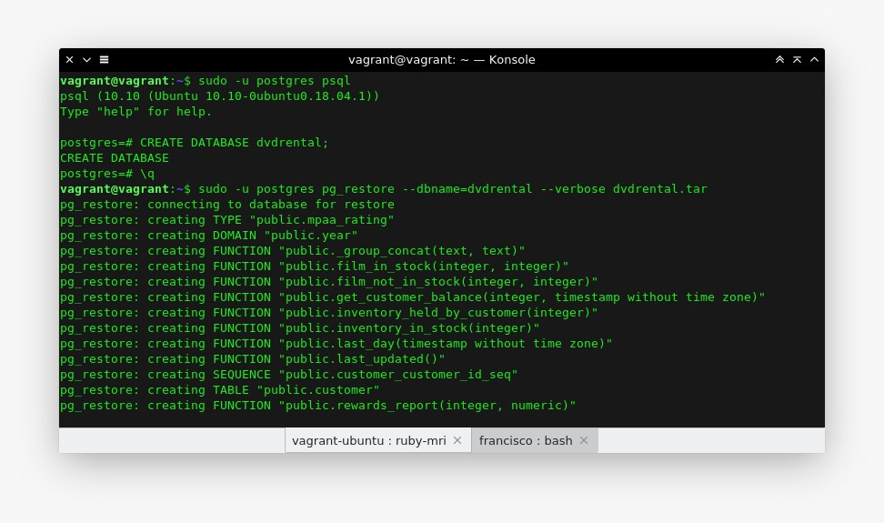
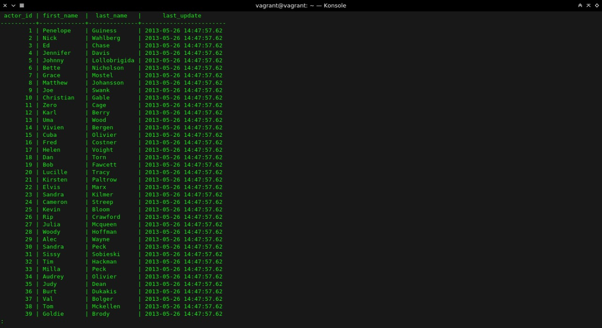
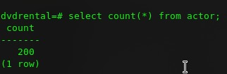
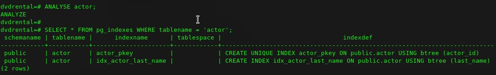
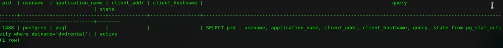
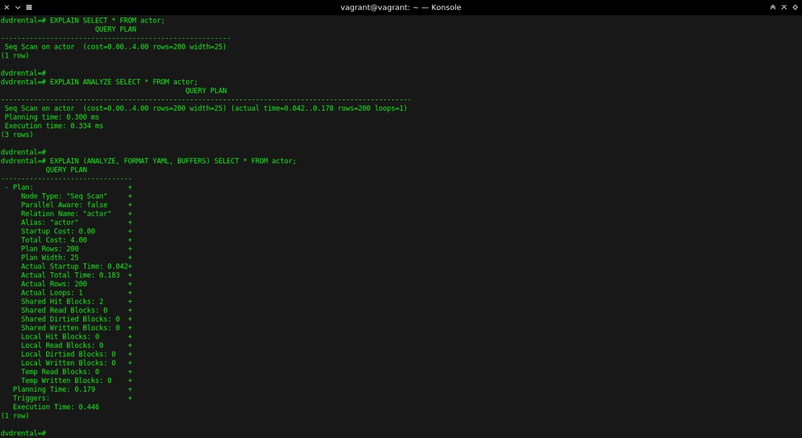

# Administracion de Base de Datos 

## Practica NUmero 4
---
##Restauración de una Base de Datos.

---

Obtencion y descompresión del la base de datos a travez de los comandos ***WGET*** y ***UNZIP***

Iniciar ***postgres*** y creamos una base de datos vacia llamada ***dvfrental***

Restaurando la Base de Datos

Mostrando cuantos registros tiene la Tabla ***Actor***

ANALYSE actor; 

Mas comandos que no entiendo pero estaban ahí

